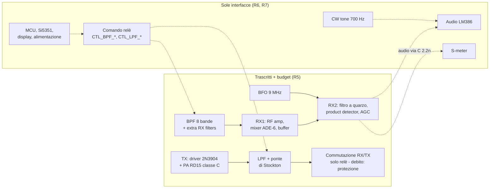
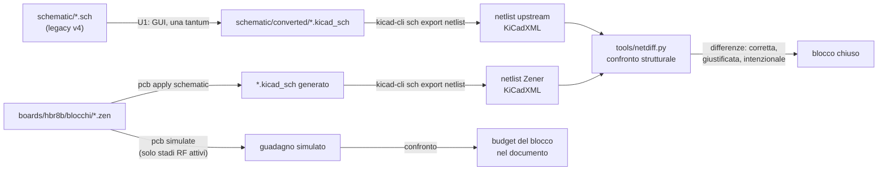

# Documento a blocchi e schema Zener - Plan

## Goal Capsule

**Obiettivo:** chi lavora sul progetto sa, per ogni blocco del transceiver, cosa fa, con quali livelli e impedenze si interfaccia ai blocchi vicini, e se resta com'è o va sostituito — e lo schema esiste in una forma versionabile e verificabile invece che in un file KiCad 5 ereditato.

**Mezzo:** documento a blocchi (flow chart, budget, interfacce, punti deboli) più riscrittura dello schema in Zener, costruiti sulla stessa scomposizione in blocchi.

**Autorità di prodotto:** `STRATEGY.md` alla radice del repo. La riprogettazione dei blocchi classificati come interfaccia non è perimetro attivo di questo lavoro.

**Blocchi aperti:** nessuno.

**Profilo di esecuzione:** lavoro incrementale per blocchi, un blocco per commit. Il blocco pilota (U4) collauda l'intero metodo prima che il resto parta.

**Product Contract preservation:** invariato. Nessun R-ID modificato in questa fase; le domande aperte su conversione, confronto netlist e forma del documento sono risolte sotto come KTD1, KTD2, KTD3 e KTD8.

## Product Contract

### Summary

Il lavoro produce due artefatti accoppiati: un documento a blocchi di HBR/8B e lo schema riscritto in Zener. I blocchi RF critici sono trascritti fedelmente e confrontati con la netlist dello schema upstream; gli altri diventano interfacce definite verso i futuri moduli commerciali. Si ferma prima del layout.

### Problem Frame

Lo schema upstream è l'unica descrizione esistente del transceiver e non è navigabile: 14 fogli KiCad 5 senza un solo pin gerarchico, collegati esclusivamente per nome di global label. Non esiste alcun documento a blocchi, e `schematic/hbr-8b.kicad_pcb` è un segnaposto da 51 byte, quindi non ci sono layout, footprint né BOM da cui dedurre le scelte fisiche.

I livelli attesi sono annotati solo a tratti, e proprio dove il progetto è più facile da sbagliare non c'è niente: il primo mixer ADE-6, il filtro a quarzo, l'AGC, il driver e il PA non hanno alcuna cifra di guadagno o perdita sullo schema.

Questo è il punto in cui i progetti precedenti si sono arenati. Senza una mappa dei livelli e delle interfacce, ogni modifica a un blocco è una scommessa sul comportamento dei blocchi vicini, e l'errore si scopre dopo che le schede sono state ordinate.

### Key Decisions

- **Ibrido: fedeltà dove serve un riferimento, interfaccia dove il blocco cambierà.** (session-settled: user-approved — scelto al posto di copia fedele integrale o riscrittura diretta: dà un riferimento verificabile sui blocchi RF senza trascrivere parti destinate a sparire.) Governs R5, R6, R7.
- **Il primo step si ferma allo schema.** (session-settled: user-directed — scelto al posto di includere un blocco pilota o l'intero layout: il layout parte a budget verificato.) Governs R14.
- **Budget analitico ovunque, SPICE solo sugli stadi RF attivi.** (session-settled: user-directed — corretto in dialogo da "SPICE sugli stadi attivi" a "solo RF": l'audio non si simula.) Governs R9, R10.
- **LM386, S-meter e CW tone sono interfacce, non blocchi fedeli.** (session-settled: user-approved — scelto al posto di trascriverli: nessuno dei tre è RF e tutti e tre sono candidati alla sostituzione.) Governs R7.
- **I moduli Zener seguono la funzione, non la futura scheda fisica.** Il partizionamento sulle PCB innestabili è una decisione di layout.

### Requirements

**Documento a blocchi**

- R1. Il documento contiene un flow chart della catena RX e della catena TX, dall'antenna all'audio e dal tasto all'antenna, con i punti di commutazione T/R e di banda.
- R2. Per ogni blocco il documento riporta il budget: guadagno o perdita attesa, livelli e impedenze in ingresso e uscita, assorbimento in RX e in TX con il rail di alimentazione da cui dipende, margine rispetto al blocco successivo. Ogni cifra porta una qualità fra tre: misurata, citata con incertezza (riportando l'incertezza dichiarata dall'upstream e la posizione `file:riga`), calcolata. Ogni voce porta la propria tolleranza, e il margine a ogni interfaccia è calcolato nel caso peggiore sommando le tolleranze, non i valori nominali. Il budget della catena TX dichiara accanto ai propri numeri la tensione di rail contro cui è calcolato.
- R3. Per ogni blocco il documento definisce l'interfaccia: segnali, livelli, impedenze, alimentazione e controlli dall'MCU.
- R3b. Per i blocchi di R7, destinati a essere sostituiti, le cifre dell'interfaccia sono i limiti che il modulo futuro dovrà rispettare — intervalli ammessi di livello, impedenza e alimentazione, più la forma del segnale (analogico o digitale) — non la fotografia del circuito attuale. Il valore upstream resta riportato accanto come riferimento.
- R4. Per ogni blocco il documento dà un verdetto fra tieni, cambia e sostituisci con modulo, con la motivazione ricondotta a un criterio di `STRATEGY.md`. Ogni verdetto porta una prova di esistenza: per tieni e cambia, le parti critiche o attive confermate acquistabili oggi con fonte e data; per sostituisci con modulo, almeno un modulo commerciale reale che soddisfi l'interfaccia di R3. La BOM completa resta fuori perimetro (R14).

**Classificazione dei blocchi**

- R5. Sono trascritti fedelmente e verificati: BPF delle otto bande, extra RX filters, RF amp, primo mixer, buffer e catena di RX1, filtro a quarzo, product detector e AGC di RX2, BFO, driver TX e PA, LPF, ponte di Stockton.
- R5c. La commutazione RX/TX d'antenna (relè sul foglio radice, connettore coassiale, transistor di comando da `ENABLE_TX`) è trascritta fedelmente così com'è, cioè con il solo relè. Il documento registra come debito aperto l'aggiunta di una protezione d'ingresso RX, assente nell'upstream: nessun clamp né limitatore esiste sul percorso d'antenna o prima dei filtri di ricezione. Il debito si salda in uno step successivo, insieme al passaggio al QSK a diodi PIN.
- R5b. Il filtro a quarzo resta fra i blocchi trascritti come riferimento di misura, ma il suo budget riporta banda a −6 dB, ripple e perdita d'inserzione, e il suo verdetto si motiva sul confronto con il target di `STRATEGY.md` (300–400 Hz, ottimo a 400 Hz), non sulla parità di netlist. I valori dei condensatori upstream sono segnaposto dipendenti dai cristalli misurati col metodo G3UUR: la netlist li trascrive, non li convalida.
- R6. La commutazione a relè di BPF e LPF è documentata come interfaccia di controllo (`CTL_BPF_*`, `CTL_LPF_*`) e non come circuito da riprodurre.
- R7. Sono documentati come sola interfaccia: amplificatore audio LM386, S-meter, CW tone, MCU, Si5351, display, alimentazione. L'interfaccia del CW tone riporta il vincolo che il sidetone deve stare all'offset del BFO, cioè 700 Hz.

**Schema in Zener**

- R8. Ogni blocco del documento ha un modulo Zener corrispondente, con l'interfaccia di R3 come porte del modulo; l'insieme compila con `pcb build`.
- R9. Gli stadi RF attivi — stadi di amplificazione a transistor, lineari o quasi lineari, sul percorso RF: amplificatore di retroazione del BFO, RF amp e buffer di RX1, stadi driver del TX — sono simulati con `pcb simulate` e il risultato è confrontato con il budget di R2. Una simulazione che sostituisce un componente con un modello ideale dichiara la sostituzione accanto al risultato e non vale come verifica.
- R10. Restano verificati per via analitica i blocchi esclusi dalla definizione di R9: PA classe C (non lineare), mixer (prestazioni da datasheet), filtro a quarzo (passivo, dipendente dai cristalli misurati) e AGC (banda audio). Il documento dichiara per ciascuno il motivo dell'esclusione.
- R11. Per i blocchi di R5 la netlist del modulo Zener è confrontata con quella dello schema upstream e le differenze sono elencate una per una, ciascuna corretta, giustificata, oppure dichiarata intenzionale. Una differenza intenzionale è ammessa solo se riconducibile a un verdetto «cambia» registrato in R4 e accompagnata dal criterio di `STRATEGY.md` che la motiva; per quei blocchi il riferimento del confronto resta la netlist upstream congelata all'atto della trascrizione.
- R12. I nomi delle global label upstream sono conservati come nomi di net nello Zener, così che il confronto di R11 resti leggibile.
- R13. Dove due fogli usano nomi diversi per lo stesso segnale, o lo stesso nome per segnali diversi, il documento registra l'ambiguità e la scelta fatta; non la risolve d'ufficio in silenzio. L'audit delle etichette è stato eseguito sui 14 fogli: 75 nomi distinti, nessuna collisione (nessun nome su segnali diversi, nessun nome senza sorgente), un solo net pilotato da due fogli (`BPFS_OUT`, da `bpf-relays-1.sch` e `bpf-relays-2.sch`, legittimo perché un solo relè è chiuso per volta).
- R13b. 21 dei 75 nomi non escono mai dal proprio foglio (pulsanti, encoder, I2C, `RFAMP_IN`, `RFAMP_OUT`, `FIRST_MIX_IN`, `AFAMP_IN`, `VCC_TX`): sono etichette globali usate per cablare all'interno della stessa pagina. Le interfacce di R3 non si ricavano quindi dall'elenco delle etichette, che sovrastimerebbe i confini di un terzo, ma dal percorso del segnale fra blocchi.

**Confine**

- R14. Nessun layout e nessun ordine di PCB rientrano in questo lavoro. Poiché `pcb build` richiede un footprint per ogni componente, le impronte assegnate in questa fase sono provvisorie e non vincolano il layout: i default SMD dei generics della stdlib non si usano su componenti RF, magnetici o di potenza, e ogni impronta assegnata finisce in un registro «da rivedere al layout» dentro il documento a blocchi.

### Struttura della classificazione

### Acceptance Examples

- AE1. **Covers R11.** La netlist Zener del BFO differisce dall'upstream per un resistore da 47 Ω assente. La differenza compare nell'elenco con la sua causa; non è ammesso chiudere il blocco lasciandola non spiegata.
- AE2. **Covers R2, R9.** La simulazione dell'RF amp dà 14 dB mentre il budget analitico ne prevedeva 10. Il documento riporta entrambi i valori e indica quale si assume, con il motivo.
- AE3. **Covers R13.** `BPFS_OUT` è pilotato da due fogli diversi, `bpf-relays-1.sch` e `bpf-relays-2.sch`. Il documento registra che è un net unico con due sorgenti mutuamente esclusive, non una collisione di nomi, e mantiene il nome nello Zener.
- AE4. **Covers R4.** Il blocco S-meter riceve verdetto «sostituisci». La motivazione non può dire che il livello è già leggibile dall'ADC, perché è questo blocco a produrre la continua che il firmware legge: il verdetto nomina prima da dove verrà la rivelazione dopo la rimozione, e solo allora invoca consumo e spazio.

### Success Criteria

- Una persona che non ha mai visto lo schema upstream capisce la catena del segnale leggendo solo il documento.
- Ogni blocco di R5 ha budget completo e nessuna differenza di netlist non spiegata.
- Il documento e lo Zener nominano gli stessi blocchi, così che una modifica futura si applichi a entrambi senza traduzione.

### Scope Boundaries

- Fuori: riprogettazione dei blocchi interfaccia, cioè commutazione bande senza relè, sidetone, S-meter, scelta del modulo audio, MCU e clock. Il documento ne registra i verdetti, non le soluzioni.
- Fuori: firmware. Si documentano i segnali di controllo e i canali ADC; il codice non si tocca.
- Fuori: layout, footprint, BOM e ordini (R14). Il display definitivo resta alla fase 2 come stabilito in `STRATEGY.md`.

### Dependencies / Assumptions

- Il formato legacy si converte solo dalla GUI. Verificato: il lettore del formato v4 è presente in KiCad 10 (`SCH_IO_KICAD_LEGACY`, 8 occorrenze in `_eeschema.kiface`), quindi aprire e risalvare da eeschema converte; la via da riga di comando invece è monca — `kicad-cli sch upgrade` fallisce con errore di parsing, e `kicad-cli sch export netlist` sul file legacy produce un XML con il cartiglio corretto ma `<components/>` e `<nets/>` vuoti. La conversione è quindi un passo manuale una tantum (U1), dopo il quale tutto il resto è automatizzabile.
- Lo schema upstream è annotato solo a metà: 177 dei 443 componenti reali portano un riferimento provvisorio, e `bfo.sch` è annotato al 100% mentre `bpf-relays-1/2` non lo sono affatto. L'annotazione dello schema convertito (U1) è quindi un prerequisito del confronto, non una rifinitura, e da quel momento il riferimento del progetto è lo schema annotato anziché il PDF upstream.
- Il confronto di netlist ha una sola fonte, lo schema convertito. `schematic/hbr-8b.kicad_pcb` è un file segnaposto da 51 byte, quindi non esiste una netlist di layout da usare come controprova.
- Rail di alimentazione di riferimento: va fissato prima del budget della catena TX, con tensione nominale e tensione minima a batteria scarica per la configurazione LiPo assunta. L'upstream lavora a 12–13,8 V; `STRATEGY.md` impegna il progetto su alimentazione LiPo.
- La simulazione richiede ngspice installato come eseguibile (KTD6) e un modello dichiarato sul componente (KTD10) per ogni parte attiva o magnetica degli stadi di R9, compreso il trasformatore `PA0184NL`, presente in tutti e tre. Se un modello manca, quel blocco ricade nella verifica analitica di R10; la variante ideale è ammessa solo come componente dedicato e dichiarato, e in quel caso non conta come verifica ai fini di R9.
- Ipotesi: le global label upstream identificano correttamente i nodi che collegano. Non è verificata filo per filo su tutti i fogli.

### Outstanding Questions

**Risolte in planning** — conversione legacy (KTD1), sorgente delle netlist (KTD2), criterio e strumento di confronto (KTD3), forma del documento (KTD8).

**Deferred to Implementation**

- Se `pcb import` sul file convertito produca moduli riusabili o solo una base da riscrivere: si decide in U4, sul blocco pilota, confrontando l'output con un modulo scritto a mano.
- Quali modelli SPICE adottare per `PA0184NL` e per i toroidi FT50-43, e se un modello ideale dichiarato basti per gli stadi di R9.
- Quale configurazione LiPo fissare come rail di riferimento (due o tre celle), da decidere prima del budget della catena TX in U8.

### Sources / Research

- Dossier di grounding con citazioni `file:riga`: `/tmp/compound-engineering-501/ce-brainstorm/hbr8b-zener-docs/grounding.md` (temporaneo).
- Nessun pin gerarchico in alcun foglio: `grep -c "^F2 " schematic/*.sch` restituisce 0 ovunque.
- Prelievo S-meter verificato: `AFAMP_IN` → C108 da 2,2 nF → `S_METER_IN` in `schematic/rx2.sch:1428-1446`.
- ADC del firmware: S-meter su canale 2 (`firmware/Src/main.c:543`), `PWR_FWD` su 0 (`:942`), `PWR_REF` su 1 (`:949`). Sidetone su `GPIOB PIN_11` (`:582-589`).
- Offset BFO di 700 Hz: `schematic/bfo.sch:317`. Oscillatore a ponte di Wien a 700 Hz: `schematic/cw-tone.sch:444`.
- Upstream consiglia LTspice per il filtro a quarzo, con cristalli misurati col metodo G3UUR: `schematic/rx2.sch:1361`.
- Convenzioni Zener del progetto gemello: `boards/`, `components/`, `modules/` con `pcb.toml`, e schema a blocchi in `docs/` richiamato dal README (`vhf-transverter/README.md:8`).
- Regole operative del progetto gemello, adottate qui: MPN scelti dall'autore e mai inventati, footprint da datasheet o `easyeda2kicad` e mai a memoria, minimo 0603 per saldabilità a mano.
- Round-trip verificato sul binario `pcb` 0.4.53: `pcb apply schematic` scrive `.kicad_sch` dal sorgente Zener, ma solo quando il file dichiara `Board(..., schematic=True)`; su un modulo esce con codice zero e non scrive nulla. `pcb build` non produce alcun artefatto di netlist.
- `pcb import` preserva la gerarchia (un `.zen` radice più `modules/<istanza>/` per foglio) ma ricava le porte dai pin gerarchici, che qui non esistono. Dare in pasto il `.kicad_sch`, non il `.kicad_pro`: con il progetto intero il comando pretende la parità schema-layout e si ferma.
- `libngspice` è già presente nel bundle KiCad (`/Applications/KiCad/KiCad.app/Contents/PlugIns/sim/`).

---

## Planning Contract

### Key Technical Decisions

- KTD1. **La conversione degli schemi upstream è un passo manuale una tantum dalla GUI di eeschema.** Il lettore legacy esiste in KiCad 10 ma è raggiungibile solo dall'interfaccia grafica. Scartato: installare un KiCad più vecchio (non serve), scrivere un parser del formato v4 (nessuna libreria esistente lo legge). Governs R11.
- KTD2. **Le due netlist da confrontare si producono entrambe come KiCadXML.** Lato upstream: `kicad-cli sch export netlist` sul file convertito e annotato in U1. Lato Zener: `pcb apply schematic` genera un `.kicad_sch` dal sorgente, poi lo stesso export. Confrontare formati omogenei elimina le differenze dovute al formato. **Vincolo verificato:** `pcb apply schematic` scrive qualcosa solo se il `.zen` dichiara `Board(..., schematic=True)`; su un modulo senza `Board()` esce con codice zero, stampa `null` e non scrive nulla. Ogni blocco confrontabile di R5 è quindi dichiarato come board a sé, con la propria directory di progetto KiCad trattata come artefatto derivato e non versionata (R14 resta rispettata). Governs R11.
- KTD3. **Il confronto è strutturale sui collegamenti e per riferimento sui componenti.** Uno script locale costruisce da ogni XML il grafo componente-pin ↔ nodo e lo confronta ignorando i nomi dei net, riportando le differenze come coppie di pin. I componenti si accoppiano invece per riferimento (`R12`, `C108`): i componenti dei blocchi di R5 sono dichiarati nel sorgente Zener con `name=` uguale al riferimento upstream, univoco nello scope della board, perché altrimenti l'annotatore li rinumera e il confronto fallisce su tutto. Un riferimento presente da un lato e assente dall'altro è un errore esplicito, non una differenza di collegamento. Footprint e valore restano informativi e fuori dal confronto: i due lati li scrivono in notazioni disgiunte per costruzione, e le impronte di questa fase sono provvisorie (R14). I nomi delle label upstream restano nel sorgente per leggibilità sui confini (R12). Governs R11, R12.
- KTD4. **Struttura del workspace identica a `vhf-transverter`:** `components/` per le parti, `modules/` per i sotto-circuiti riusabili, `boards/hbr8b/` per la composizione, ciascuno con il proprio `pcb.toml`. Un blocco del documento corrisponde a un modulo, non a una futura scheda fisica.
- KTD5. **Ordine di attacco: BFO per primo come collaudo del metodo**, poi i banchi filtri, poi la catena RX, poi la catena TX, infine i blocchi a sola interfaccia. Il BFO è l'unico blocco con guadagni annotati dall'autore (`bfo.sch:317`, `:540`, `:903`), è piccolo (~41 componenti) ed è l'unico su cui i tre meccanismi — trascrizione, simulazione, confronto — si applicano tutti. Un difetto di metodo si paga una volta invece che otto.
- KTD6. **ngspice da Homebrew** (`brew install ngspice`). Verificato che `pcb simulate` cerca un **eseguibile** in `/opt/homebrew/bin/ngspice` o al percorso della variabile `NGSPICE`, mentre il bundle KiCad espone solo `libngspice.dylib`: non è un ripiego utilizzabile. Senza ngspice installato, gli stadi di R9 ricadono nella verifica analitica dichiarata di R10.
- KTD9. **Tutti i simboli del workspace dichiarano il formato KiCad 10.** Verificato che `pcb apply schematic` rifiuta i simboli in formato 20211014 con un errore esplicito, e che tutti i `.kicad_sym` di `vhf-transverter` — come l'output di `easyeda2kicad` — sono in quel formato. Ogni simbolo ripreso o generato passa per `kicad-cli sym upgrade` prima di entrare in `components/`.
- KTD10. **I modelli SPICE si dichiarano sul componente**, con `spice_model=SpiceModel(...)` dentro il `Component()` della parte in `components/`. Verificato che i modificatori `assign_spice_model()` e `use_ideal_passives()` della stdlib installata sono segnaposto vuoti («TODO: implement once the toolchain exposes spice models»): la variante ideale di uno stadio di R9 si ottiene con un secondo componente dedicato, non con un modificatore.
- KTD7. **Footprint provvisori con vincoli espliciti:** minimo 0603, mai i default SMD della stdlib su componenti RF, magnetici o di potenza, ogni assegnazione annotata nel registro «da rivedere al layout». Gli MPN restano vuoti finché non li sceglie l'autore. Governs R14.
- KTD8. **Il documento a blocchi è markdown con diagrammi Mermaid** sotto `docs/`, richiamato dal README. Un SVG esportato resta possibile in seguito senza cambiare la fonte.

### High-Level Technical Design

Il ciclo di verifica di ogni blocco, una volta preparato l'ambiente:

### Assumptions

- La conversione dalla GUI produce tutti e 14 i fogli in un unico progetto coerente. U1 lo verifica contando componenti e net nella netlist esportata: un XML con `<components/>` vuoto significa conversione fallita, non schema vuoto.
- Il grafo estratto dalla KiCadXML è sufficiente per il confronto strutturale: contiene riferimento, valore, footprint e l'elenco dei pin per ogni net. Se mancasse qualche informazione, il ripiego è annotare preventivamente i nodi interni nello schema convertito.
- `pcb apply schematic` produce un `.kicad_sch` leggibile da `kicad-cli` senza passaggi intermedi. U4 lo verifica sul blocco pilota, prima che il resto del lavoro vi si appoggi.

### Sequencing

U1 e U2 sono indipendenti e possono procedere in parallelo. U3 dipende da U1 (serve una netlist vera su cui provare lo script). U4 è il cancello: finché il BFO non chiude con budget, simulazione e confronto puliti, U6-U9 non partono. U5 nasce con U4 e cresce a ogni blocco successivo. U10 chiude quando tutti i blocchi hanno verdetto.

---

## Implementation Units

| U-ID | Titolo | File principali | Dipende da |
|---|---|---|---|
| U1 | Conversione upstream e netlist di riferimento | `schematic/converted/`, `docs/netlist-upstream.xml` | — |
| U2 | Impalcatura del workspace Zener | `pcb.toml`, `components/`, `modules/`, `boards/hbr8b/` | — |
| U3 | Strumento di confronto strutturale | `tools/netdiff.py` | U1 |
| U4 | Blocco pilota BFO | `boards/hbr8b/blocchi/Bfo.zen` | U1, U2, U3 |
| U5 | Documento a blocchi | `docs/blocchi.md` | U4 |
| U6 | Banchi filtri e comando bande | `modules/BpfBanda.zen`, `modules/LpfBanda.zen` | U4, U5 |
| U7 | Catena di ricezione | `boards/hbr8b/blocchi/Rx1.zen`, `Rx2.zen` | U4, U5 |
| U8 | Catena di trasmissione e commutazione | `boards/hbr8b/blocchi/Tx.zen`, `Stockton.zen`, `TrSwitch.zen` | U4, U5 |
| U9 | Blocchi a sola interfaccia | `docs/blocchi.md`, `boards/hbr8b/Hbr8b.zen` | U5 |
| U10 | Verdetti, registro footprint e cancello di fabbricazione | `docs/blocchi.md`, `docs/footprint-da-rivedere.md` | U5-U9 |

### U1. Conversione upstream e netlist di riferimento

**Goal:** avere lo schema upstream in formato moderno e la netlist di riferimento contro cui si confronterà ogni blocco.

**Requirements:** abilita R11; risolve la dipendenza dichiarata nelle Assumptions.

**Dependencies:** nessuna.

**Files:** `schematic/converted/*.kicad_sch` (nuovi), `docs/netlist-upstream.xml` (nuovo), `docs/blocchi.md` (nota di provenienza).

**Approach:**
1. Aprire `schematic/hbr-8b.sch` nella GUI di eeschema e salvare il progetto convertito sotto `schematic/converted/`, lasciando intatti i file legacy originali.
2. Annotare lo schema convertito conservando i riferimenti esistenti: 177 dei 443 componenti reali portano ancora un riferimento provvisorio (`R?`, `C?`, `Q?`) e senza annotazione i loro pin restano nodi non attribuibili a nessun componente. Lo schema annotato diventa il riferimento ufficiale del progetto, al posto del PDF upstream.
3. Esportare la netlist con `kicad-cli sch export netlist --format kicadxml` dal file convertito e annotato, e congelarla come riferimento di R11.
4. Verificare i conteggi, per totale e per foglio.
5. Registrare nel documento quale versione di KiCad ha fatto la conversione, in che data, e che i riferimenti dei 177 componenti sono stati assegnati qui.

**Execution note:** conversione e annotazione sono manuali, dalla GUI; tutto il resto dell'unità è verifica automatica del risultato.

**Test scenarios:**
- La netlist esportata contiene 441 componenti. Il conteggio per simboli darebbe 443: l'NE5532 del generatore di nota è un doppio operazionale che compare come tre simboli (le due metà più l'alimentazione) ma è un solo integrato, `U10`.
- I conteggi per foglio corrispondono: bfo 41, bpf-relays-1 24, bpf-relays-2 24, bpfs 54, cw-tone 20, extra-rx-filters 11, hbr-8b 29, lpf-relays 28, lpfs 40, rx1 34, rx2 59, s-meter 23, stockton-birdge 18, tx 36.
- Nessun riferimento di componente e nessun nodo della netlist termina con `?`.
- Ogni nome di global label documentato in R13 compare fra i net della netlist.
- Un net noto a due sorgenti (`BPFS_OUT`) compare una volta sola, con i pin di entrambi i fogli relè. Covers AE3.
- L'esportazione ripetuta sullo stesso file dà lo stesso risultato.

**Verification:** la netlist di riferimento esiste, è completa e annotata, ed è committata insieme allo schema convertito.

### U2. Impalcatura del workspace Zener

**Goal:** un workspace che compila a vuoto, con le convenzioni del progetto gemello già in piedi.

**Requirements:** abilita R8; applica KTD4, KTD7.

**Dependencies:** nessuna.

**Files:** `pcb.toml` (nuovo), `components/pcb.toml`, `modules/pcb.toml`, `boards/hbr8b/pcb.toml`, `boards/hbr8b/Hbr8b.zen`, `CLAUDE.md` (regole operative), `.gitignore`.

**Approach:**
1. Creare il workspace con la stessa stratificazione di `vhf-transverter`: componenti alla base, moduli sopra, board in cima.
2. Scrivere in `CLAUDE.md` le regole già valide nell'altro progetto: MPN mai inventati, footprint da datasheet o `easyeda2kicad`, minimo 0603. Aggiungere le due regole nuove: simboli solo in formato KiCad 10 (KTD9), riferimenti dei componenti uguali a quelli upstream sui blocchi di R5 (KTD3).
3. Installare ngspice con Homebrew e verificare che `pcb simulate` lo trovi (KTD6).
4. Un `Hbr8b.zen` vuoto che compila serve da scheletro per i blocchi successivi.

**Test scenarios:**
- `pcb build` sul workspace vuoto termina senza errori.
- `pcb simulate` su un circuito RC banale produce un risultato.
- Ogni `.kicad_sym` presente in `components/` dichiara una versione di formato pari o successiva a 20251024; un simbolo più vecchio fa fallire il controllo.
- `pcb fmt` non modifica i file appena scritti.

**Verification:** il workspace compila e le regole operative sono scritte dove un agente le legge.

### U3. Strumento di confronto strutturale

**Goal:** uno script che dice se due netlist descrivono lo stesso circuito, ignorando i nomi dei collegamenti.

**Requirements:** implementa R11, R12; applica KTD3.

**Dependencies:** U1.

**Files:** `tools/netdiff.py` (nuovo), `tools/README.md`.

**Approach:**
1. Leggere due file KiCadXML e costruire per ciascuno il grafo: nodi = net, archi = pin di componente, accoppiando i componenti per riferimento (KTD3).
2. Confrontare i due grafi a meno del nome dei net, riportando le differenze come coppie di pin: connessione presente da una parte sola, componente mancante, valore diverso dopo normalizzazione.
3. Normalizzare i valori prima del confronto — notazione ingegneristica, unità esplicita, suffissi legacy risolti — ed escludere il footprint, che i due lati scrivono in notazioni disgiunte e che in questa fase è provvisorio (R14): resta nel rapporto come informazione, non come differenza.
4. Uscita leggibile e codice di uscita diverso da zero quando restano differenze.
5. Accettare un file di eccezioni dove si registrano le differenze intenzionali, con il verdetto R4 che le motiva.

**Test scenarios:**
- Due netlist identiche: nessuna differenza, uscita zero.
- Una netlist con un resistore rimosso: la differenza è riportata con il riferimento del componente. Covers AE1.
- Una netlist con gli stessi collegamenti ma tutti i net rinominati: nessuna differenza.
- Una netlist con due pin scambiati fra due net: entrambe le differenze riportate.
- Un riferimento presente da un lato solo: errore esplicito di accoppiamento, non differenza di collegamento.
- Stessi collegamenti con footprint scritti nelle due notazioni diverse: nessuna differenza; il footprint compare solo nel rapporto informativo.
- Valore `100n` da un lato e `100nF` dall'altro: nessuna differenza.
- Una differenza elencata nel file delle eccezioni non fa fallire l'uscita ma resta nel rapporto.

**Verification:** lo script gira sulla netlist di riferimento contro sé stessa e riporta zero differenze.

### U4. Blocco pilota BFO

**Goal:** un blocco completo dall'inizio alla fine, che dimostra che il metodo regge.

**Requirements:** R2, R5, R8, R9, R11, R12; applica KTD5.

**Dependencies:** U1, U2, U3.

**Files:** `boards/hbr8b/blocchi/Bfo.zen` (nuovo), `components/` (parti nuove: cristallo, `PA0184NL`, 2N3904), `docs/blocchi.md` (sezione BFO).

**Approach:**
1. Provare `pcb import` sul foglio convertito del BFO e confrontarne l'esito con un modulo scritto a mano: la scelta vale per tutti i blocchi successivi e va registrata nel documento prima che U6-U8 partano.
2. Scrivere il blocco come board a sé (`Board(..., schematic=True)`, KTD2), con le porte che corrispondono all'interfaccia, i nomi delle label upstream sui confini e i riferimenti dei componenti uguali a quelli upstream (KTD3).
3. Compilare il budget: i tre valori annotati dall'autore vanno riportati come citazioni con incertezza, il resto calcolato.
4. Simulare l'amplificatore di retroazione e confrontare il risultato con il budget. Il modello SPICE si dichiara sul componente (KTD10); se per il trasformatore non ne esiste uno, la variante ideale è un secondo componente dedicato e va dichiarata come tale.
5. Generare la netlist dal sorgente e confrontarla con quella di riferimento.

**Execution note:** questa unità è il collaudo del metodo. Se il confronto o la simulazione non reggono qui, si ferma tutto e si rivede l'approccio, invece di ripetere l'errore sugli altri blocchi.

**Test scenarios:**
- `pcb build` compila il modulo senza errori.
- `pcb apply schematic` stampa la riga «schematic created» e il `.kicad_sch` risultante è più recente del `.zen`: il solo codice di uscita zero non prova che sia stato scritto qualcosa.
- Il confronto con la netlist di riferimento chiude a zero differenze non spiegate. Covers AE1.
- La simulazione riporta un guadagno confrontabile con la nota upstream di 10–12 dB a 9 MHz; se diverge, entrambi i valori finiscono nel documento con il motivo. Covers AE2.
- Il budget del blocco dichiara la qualità di ogni cifra: le tre citate con la loro incertezza, le altre calcolate.
- L'uscita dichiarata di ~7 dBm su 50 Ω compare come citazione, non come misura.

**Verification:** il blocco BFO ha modulo, budget, simulazione e confronto chiusi, e la sezione del documento è leggibile da sola.

### U5. Documento a blocchi

**Goal:** la struttura del documento, con il flow chart e le tabelle che i blocchi successivi riempiranno.

**Requirements:** R1, R2, R3, R13, R13b; applica KTD8.

**Dependencies:** U4.

**Files:** `docs/blocchi.md` (nuovo), `README.md` (collegamento).

**Approach:**
1. Flow chart della catena di ricezione e di quella di trasmissione, con i punti di commutazione, ricavati dal percorso del segnale e non dall'elenco delle etichette.
2. Una tabella per le interfacce e una per il budget, con le colonne già previste dai requisiti, compresa la qualità di ogni cifra.
3. Sezione sulle ambiguità di nome con i risultati dell'audit già eseguito.
4. La sezione BFO scritta in U4 diventa il modello per tutte le altre.

**Test scenarios:**
- Il flow chart mostra ogni blocco classificato in R5, R6 e R7, senza buchi.
- Ogni voce del flow chart ha una riga corrispondente nella tabella delle interfacce.
- Il documento si legge senza aprire lo schema: i nomi dei segnali sono spiegati alla prima comparsa.

**Verification:** una persona che non ha mai visto lo schema ricostruisce la catena del segnale leggendo solo il documento.

### U6. Banchi filtri e comando bande

**Goal:** i filtri delle otto bande e quelli di uscita, come moduli parametrici invece che otto copie.

**Requirements:** R5, R6, R8, R11, R12.

**Dependencies:** U4.

**Files:** `modules/BpfBanda.zen`, `modules/LpfBanda.zen`, `boards/hbr8b/blocchi/Bpfs.zen`, `Lpfs.zen`, `ExtraRxFilters.zen`, `docs/blocchi.md`.

**Approach:**
1. Un modulo per la sezione di banda, con valori e numero di spire come parametri; le otto bande diventano otto istanze.
2. Il comando dei relè resta interfaccia: i segnali `CTL_BPF_*` e `CTL_LPF_*` sono porte, i circuiti di pilotaggio non si trascrivono.
3. Le note sugli avvolgimenti presenti sugli schemi vanno riportate nel documento, perché sono l'unica informazione costruttiva esistente.

**Test scenarios:**
- Il confronto di netlist chiude su tutte e otto le sezioni passabanda e su tutte e quattro quelle di uscita.
- Il net condiviso fra i due fogli relè è ricostruito come un net solo. Covers AE3.
- Ogni sezione riporta nel documento il numero di spire e il nucleo indicati dall'autore.
- Le porte di comando esistono come segnali ma senza circuito dietro.

**Verification:** filtri e comando bande chiusi nel confronto, con le note costruttive nel documento.

### U7. Catena di ricezione

**Goal:** dall'antenna all'audio, tutti i blocchi ricopiati e verificati.

**Requirements:** R2, R5, R5b, R8, R9, R10, R11.

**Dependencies:** U4.

**Files:** `boards/hbr8b/blocchi/Rx1.zen`, `Rx2.zen`, `components/Ade6/`, `docs/blocchi.md`.

**Approach:**
1. Amplificatore d'ingresso, primo mixer e buffer nel primo modulo; filtro a quarzo, rivelatore e controllo automatico di guadagno nel secondo.
2. Simulazione solo sull'amplificatore e sul buffer; mixer, filtro e controllo di guadagno restano ai conti a mano, con il motivo scritto.
3. Il filtro a quarzo riporta banda, ripple e perdita, e il suo giudizio si misura sull'obiettivo di 300–400 Hz.
4. Il prelievo dell'S-meter si documenta come derivazione dall'audio, non come uscita del rivelatore.

**Test scenarios:**
- Il confronto di netlist chiude su entrambi i moduli.
- Il budget della catena riporta la perdita di conversione del mixer e la perdita d'inserzione del filtro, entrambe calcolate e marcate come tali.
- La sezione del filtro a quarzo indica che i valori dei condensatori dipendono dai cristalli misurati.
- La derivazione dell'S-meter compare nel documento con il condensatore che la realizza.

**Verification:** catena di ricezione chiusa, con il filtro a quarzo confrontato con l'obiettivo di banda.

### U8. Catena di trasmissione e commutazione

**Goal:** dal tasto all'antenna, compresa la commutazione con il suo debito.

**Requirements:** R2, R5, R5c, R8, R9, R10, R11.

**Dependencies:** U4.

**Files:** `boards/hbr8b/blocchi/Tx.zen`, `Stockton.zen`, `TrSwitch.zen`, `docs/blocchi.md`.

**Approach:**
1. Fissare prima il rail di alimentazione di riferimento: senza quello il budget di potenza non ha senso.
2. Stadi pilota e finale nel modulo di trasmissione; il ponte di misura e la commutazione nei propri moduli.
3. Simulazione solo sugli stadi pilota; il finale in classe C resta ai conti a mano.
4. La commutazione si ricopia com'è, e il documento registra il debito della protezione mancante.

**Test scenarios:**
- Il confronto di netlist chiude sui tre moduli.
- Il budget di trasmissione dichiara accanto ai numeri la tensione di rail assunta.
- Il debito della protezione compare nel documento come voce aperta, non come nota a margine.
- Il ponte di misura riporta le due uscite verso i canali del convertitore del microcontrollore.

**Verification:** catena di trasmissione chiusa, rail dichiarato, debito registrato.

### U9. Blocchi a sola interfaccia

**Goal:** i pezzi destinati a sparire descritti come requisiti per chi li sostituirà.

**Requirements:** R3, R3b, R7, R6.

**Dependencies:** U5.

**Files:** `docs/blocchi.md`, `boards/hbr8b/Hbr8b.zen`.

**Approach:**
1. Per ciascuno: segnali, intervalli ammessi, alimentazione, forma del segnale, con il valore attuale riportato accanto come riferimento.
2. Il sidetone porta il vincolo di stare all'offset del BFO.
3. Nel file di composizione questi blocchi compaiono come porte, senza circuito.

**Test scenarios:**
- Ogni blocco di questo gruppo ha un intervallo ammesso, non un valore singolo copiato dall'upstream.
- L'interfaccia del sidetone cita l'offset di 700 Hz e la sua dipendenza dalla frequenza del filtro.
- L'interfaccia dell'S-meter descrive il segnale in ingresso e l'uscita verso il convertitore, senza presupporre il circuito attuale. Covers AE4.
- La composizione compila con questi blocchi non collegati a nulla.

**Verification:** ogni blocco a sola interfaccia è verificabile su un modulo commerciale reale.

### U10. Verdetti, registro footprint e cancello di fabbricazione

**Goal:** chiudere il documento con un giudizio per ogni blocco e la prova che si può costruire.

**Requirements:** R4, R14.

**Dependencies:** U5, U6, U7, U8, U9.

**Files:** `docs/blocchi.md`, `docs/footprint-da-rivedere.md` (nuovo), `CLAUDE.md`.

**Approach:**
1. Per ogni blocco, verdetto motivato con un criterio della strategia e con la prova che le parti si comprano ancora, o che esiste un modulo che regge l'interfaccia.
2. Registro delle impronte provvisorie, con il vincolo che nessuna sia stata presa dai default della libreria su parti RF o di potenza.
3. Scrivere in `CLAUDE.md` il cancello da superare prima di ogni ordine, nello stile già usato nel progetto gemello.
4. Alimentare il registro delle impronte anche con le assegnazioni implicite: i generics della stdlib hanno 0603 come valore predefinito, quindi un componente senza `package=` esplicito riceve un'impronta senza che nessuno l'abbia scelta.

**Test scenarios:**
- Nessun blocco resta senza verdetto.
- Ogni verdetto «tieni» o «cambia» cita una fonte di acquisto con data; ogni «sostituisci» cita un modulo reale.
- Il registro delle impronte elenca ogni componente con impronta assegnata in questa fase.
- Il verdetto sull'S-meter nomina da dove verrà la rivelazione dopo la rimozione. Covers AE4.

**Verification:** documento chiuso, con verdetti e prove, e nessuna impronta accettata per inerzia.

---

## Verification Contract

- `pcb fmt` non lascia modifiche pendenti; `pcb build` compila l'intero workspace senza errori; ogni `.kicad_sym` è in formato KiCad 10 o successivo.
- Per ogni blocco di R5, `pcb apply schematic` ha scritto davvero il `.kicad_sch` — riga «schematic created» e file più recente del sorgente — prima che il confronto venga considerato valido.
- `tools/netdiff.py` termina con codice zero su ogni blocco di R5: zero differenze, salvo quelle elencate nel file delle eccezioni con il verdetto che le motiva.
- `pcb simulate` gira sugli stadi di R9; ogni risultato ottenuto con un modello ideale dichiara la sostituzione accanto al numero.
- Il documento ha, per ogni blocco: una riga nel flow chart, una riga nella tabella interfacce, una nel budget e un verdetto.
- Nessuna verifica di layout: né DRC né controlli di fabbricazione rientrano in questo lavoro (R14).

## Definition of Done

**Globale**

- Tutti i blocchi di R5 hanno modulo, budget e confronto chiuso; tutti quelli di R6 e R7 hanno interfaccia scritta come requisito.
- Il documento a blocchi è richiamato dal README e si legge senza aprire lo schema.
- La netlist di riferimento e lo schema convertito sono nel repo, con la data e la versione di KiCad che li ha prodotti.
- Il registro delle impronte provvisorie esiste e non è vuoto.
- Nessun file di prova o script usa-e-getta resta nel repo: quello che serve sta in `tools/`, il resto si cancella.

**Per unità**

- Il modulo compila, il confronto chiude, il budget è compilato con la qualità di ogni cifra, e la sezione del documento è scritta prima di passare al blocco successivo.
